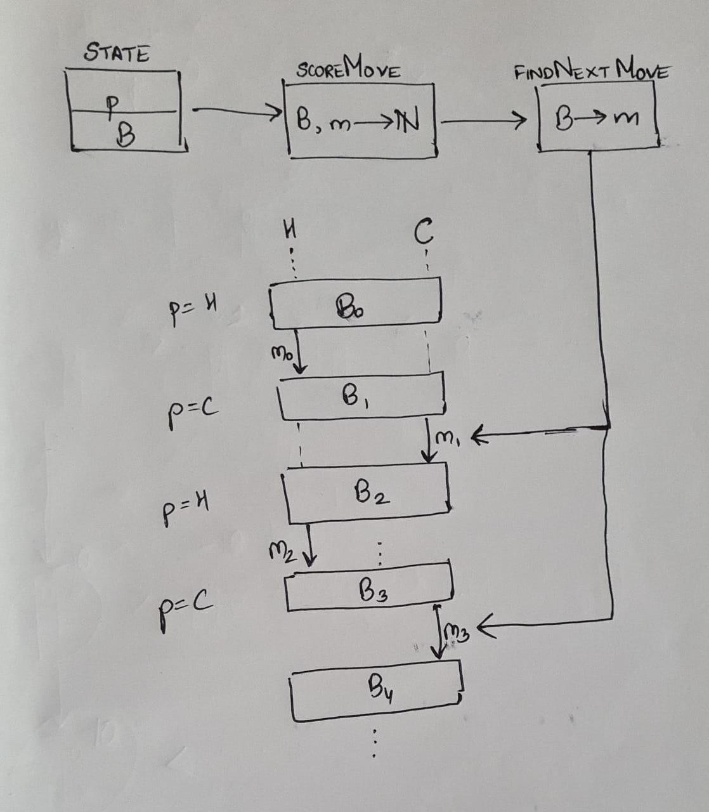

# Solution for Tic-Tac-Toe
## Game Description
Tic-tac-toe is played on a $3 \times 3$ grid, where two players alternately place `X`s and `O`s in the squares. The first player to place their symbol in three consecutive positions (a row, a column, or a diagonal) wins.  
Here, a human plays first (with the symbol `X`).

## Algorithm
This game can be solved using the minimax algorithm. The basic idea behind this algorithm is simple: let the *score* of a board be some number associated with its configuration (given which player's turn it is), which is positive if the computer will win, negative if the human will win, and 0 if it will be a draw. Then, at the human's turn, they attempt to *minimise* the score, while the computer attempts to *maximise* the score on its turn.  
[Note: both players are assumed to be playing with perfect strategy here. This assumption is acceptable as we can ensure that the computer is playing with perfect strategy, and the human playing with perfect strategy is the worst case for the computer, so the computer will certainly win if the human plays without perfect strategy.]

How do we assign scores to boards that are not in a final configuration? If the human is to play, the score of a certain move is the *maximum* of the scores of all possible following moves by the computer (since the computer will play with perfect strategy, trying to maximise the score). Similarly, if the computer is to play, the score of a move is the *minimum* of the scores of all possible following moves by the human, for corresponding reasons.  
In this way, we can inductively assign a score to all boards that form part of the game tree, and choose the optimal one at each step (ensuring that the computer either wins or draws in all cases).

## Software Design
* The state of the program $S = (p, B)$ is defined by two variables: the player $p \in \{H, C\}$ whose turn it is, and the board configuration $B$.
* Each time a move $m$ occurs, the state is altered by changing $p$ to $H$ if it was $C$, and vice versa, and updating $B$ to include the latest move $B \oplus m$.
* A scoring function (in the mathematical sense) $f$ scores a move that can be made in a given state. $f_{(p,B)} (m)$ thus represents the score of the board that results if $p$ plays the move $m$.
$$f_{(p,B)}(m) = \begin{cases}
-1, & B \text{ is a winning configuration for } H \\
0, & B \text{ is a draw} \\
1, & B \text{ is a winning configuration for } C \\
\min_\mu (f_{(H,B \oplus m)} (\mu)) & p = C \\
\max_\mu (f_{(C,B \oplus m)} (\mu)) & p = H. \end{cases}$$

* The next move is decided based on the value of $f$ according to the state of the program. We know that $p = C$ (since the computer has control only over its own moves); then the optimal move is
$$\operatorname*{argmax}_m f_{(C,B)} (m).$$

The dependencies among the various components of this program are shown below ($A \to B$ means that $B$ depends on $A$), along with a sequence diagram.

